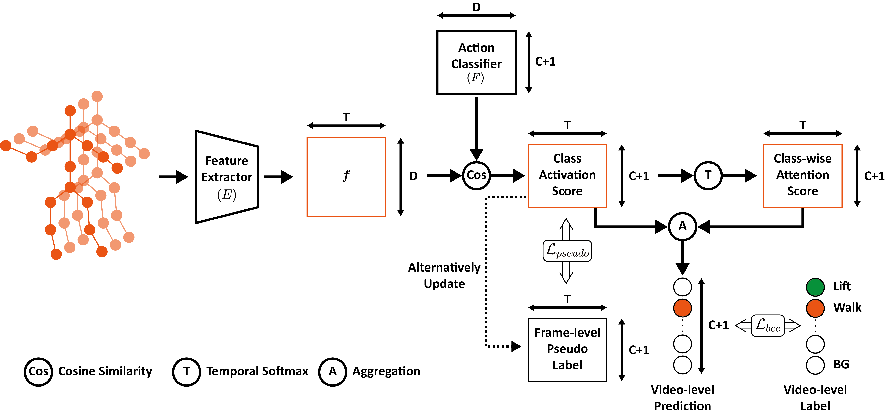

# Frame-Level Label Refinement for Skeleton-Based Weakly-Supervised Action Recognition

Sample code of Frame-Level Label Refinement for Skeleton-Based Weakly-Supervised Action Recognition

## Overview

Architecture of Network



## Requirements

```bash
conda create -n swtal python=3.7
conda activate swtal
conda install pytorch==1.10.1 torchvision==0.11.2 torchaudio==0.10.1 -c pytorch
pip install -r requirements.txt
```

## Usage
Train and evaluate the model with subset-3 of BABEL, run following commands:
```bash
python train.py --config config/train.yaml
```