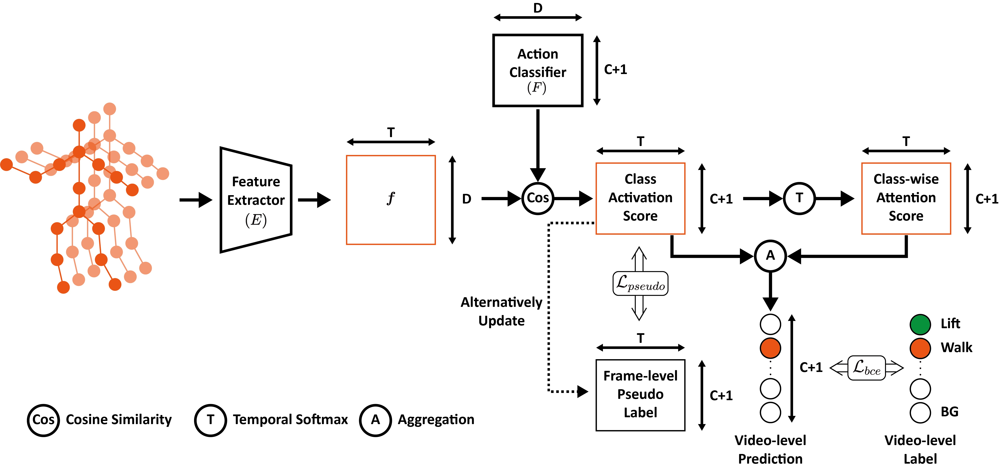

# Skeleton-Temporal-Action-Localization

Code for the paper "Frame-Level Label Refinement for Skeleton-Based Weakly-Supervised Action Recognition" (AAAI 2023).

## Overview

Architecture of Network



## Requirements
```bash
conda create -n stal python=3.7
conda activate stal
conda install pytorch==1.10.1 torchvision==0.11.2 torchaudio==0.10.1 -c pytorch
pip install -r requirements.txt
```

## Data Preparation
Due to the distribution policy of AMASS dataset, we are not allowed to distribute the data directly. We provide a series of script that could reproduce our motion segmentation dataset from BABEL dataset.

Download [AMASS Dataset](https://amass.is.tue.mpg.de/) and [BABEL Dataset](https://babel.is.tue.mpg.de/). Unzip and locate them in the `dataset` folder.

Prepare the SMPLH Model following [this](https://github.com/vchoutas/smplx/blob/main/tools/README.md#smpl-h-version-used-in-amass) and put the merged model `SMPLH_male.pkl` into the `human_model` folder. 

The whole directory should be look like this:
```
Skeleton-Temporal-Action-Localization
│   README.md
│   train.py
|   ...
|
└───config
└───prepare
└───...
│   
└───human_model
│   └───SMPLH_male.pkl
│   
└───dataset
    └───amass
    |   └───ACCAD
    |   └───BMLmovi
    |   └───...
    │   
    └───babel_v1.0_release
        └───train.json
        └───val.json
        └───...
```

And also clone the BABEL offical code into the `dataset` folder.

```bash
git clone https://github.com/abhinanda-punnakkal/BABEL.git dataset/BABEL
```

Finally, the motion segmentation dataset can be generate by:
```bash
bash prepare/generate_dataset.sh
```

## Training and Evaluation
Train and evaluate the model with subset-1 of BABEL, run following commands:
```bash
python train.py --config config/train_split1.yaml
```

## Acknowledgement
Our codes are based on [BABEL](https://github.com/abhinanda-punnakkal/BABEL), [2s-AGCN](https://github.com/lshiwjx/2s-AGCN) and [FAC-Net](https://github.com/LeonHLJ/FAC-Net).


## Citation

```
@InProceedings{yu2023frame,
  title={Frame-Level Label Refinement for Skeleton-Based Weakly-Supervised Action Recognition},
  author={Yu, Qing and Fujiwara, Kent},
  booktitle={Proceedings of the AAAI Conference on Artificial Intelligence},
  volume={37},
  number={3},
  pages={3322--3330},
  year={2023}
}
```

## License
[Apache License 2.0](LICENSE)

Additionally, this repository contains third-party software. Refer [NOTICE.txt](NOTICE.txt) for more details and follow the terms and conditions of their use.
